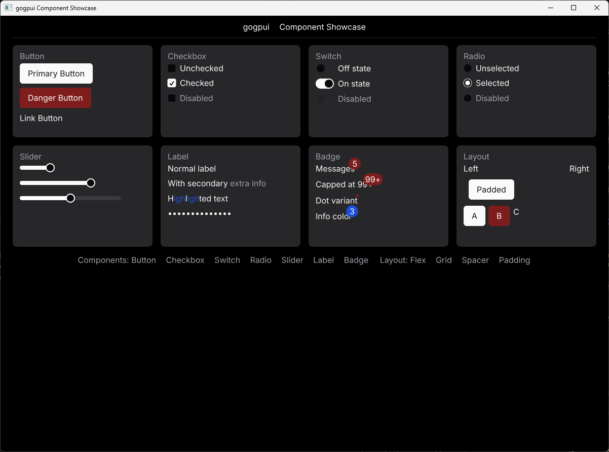

# gogpui

> A Go port of [gpui-component](https://github.com/longbridge/gpui-component) — a [shadcn/ui](https://ui.shadcn.com/)-inspired UI component library built on top of the [gogpu](https://github.com/gogpu/gogpu) / [gogpu/gg](https://github.com/gogpu/gg) GPU rendering ecosystem.

[](https://go.dev/)
[](./LICENSE)
[](https://pkg.go.dev/github.com/sofiagros/gogpui)

---

## Overview

`gogpui` brings the look and feel of `gpui-component` (a 60+ component Rust UI library) to Go.
It runs on a GPU-accelerated, **immediate-mode** rendering pipeline — every frame is drawn from scratch on the GPU, with no DOM or CSS involved.

Key properties:

- **shadcn/ui-faithful design** — colors, spacing, and interaction states match the Rust original
- **Immediate-mode API** — no retained widget trees; components are declared per frame
- **Fluent builder API** — chainable methods for zero-boilerplate widget setup
- **Dark / Light mode** — theme switching at runtime
- **Fully tested** — golden-image diff tests + synthetic-input unit tests per component



---

## Installation

```bash
go get github.com/sofiagros/gogpui
```

Requires Go 1.26+ and a WebGPU-capable GPU driver (via `github.com/gogpu/gogpu`).

---

## Quick Start

```go
package main

import (
    "github.com/gogpu/gogpu"
    "github.com/gogpu/gg/integration/ggcanvas"
    "github.com/sofiagros/gogpui/components/button"
    "github.com/sofiagros/gogpui/core/context"
    "github.com/sofiagros/gogpui/core/layout"
    "github.com/sofiagros/gogpui/core/theme"
)

func main() {
    app := gogpu.NewApp(gogpu.DefaultConfig().WithTitle("My App").WithSize(800, 600))
    uictx := context.NewUIContext()

    var canvas *ggcanvas.Canvas
    app.OnSurfaceAvailable(func() {
        canvas = ggcanvas.MustNewWithScale(app.GPUContextProvider(), 800, 600, app.ScaleFactor())
    })

    app.OnDraw(func(dc *gogpu.Context) {
        ctx := canvas.Context()
        th := theme.DefaultTheme()

        uictx.Update(ctx, th, dt, app.Input(), app.ScaleFactor())

        // Declare components — they are rendered immediately
        btn := button.New("my-button").Label("Click Me").Primary()

        layout.NewFlex().
            Direction(layout.Column).
            Gap(10).
            Add(btn).
            Render(uictx, 50, 50)

        canvas.MarkDirty()
        canvas.RenderTo(dc.AsTextureDrawer())
    })

    app.Run()
}
```

---

## Components

| Component  | Status  | Variants / Notes                          |
| ---------- | ------- | ----------------------------------------- |
| `Button`   | ✅ Done | Primary · Danger · Link · Ghost · Outline |
| `Checkbox` | ✅ Done | Default · Checked · Disabled              |
| `Switch`   | ✅ Done | Default · Checked · Disabled              |
| `Radio`    | ✅ Done | Default · Checked · Disabled              |
| `Slider`   | ✅ Done | Continuous · Disabled                     |
| `Label`    | ✅ Done | Normal · Secondary · Highlights · Masked  |
| `Badge`    | ✅ Done | Count · Max cap · Dot · Custom color      |

> See [`PORTING_LEDGER.md`](./PORTING_LEDGER.md) for the full progress table and per-component API mapping to the Rust source.

---

## API Examples

### Button

```go
button.New("id").Label("Save").Primary()
button.New("id").Label("Delete").Danger()
button.New("id").Label("Cancel").Link()
```

### Checkbox / Switch / Radio

```go
checkbox.New("id").Label("Remember me").Checked(val).OnChange(func(v bool) { val = v })
switch_comp.New("id").Label("Notifications").Checked(val).OnChange(func(v bool) { val = v })
radio.New("id").Label("Option A").Checked(val).OnChange(func(v bool) { val = v })
```

### Slider

```go
slider.New("id").Value(sliderVal).OnChange(func(v float64) { sliderVal = v })
slider.New("id").Value(0.5).Disabled(true)
```

### Label

```go
label.New("Normal text")
label.New("Title").Secondary("subtitle")
label.New("Search results").Highlights("earch", false)
label.New("secret").Masked(true)
```

### Badge

```go
badge.New().Count(5).Add(label.New("Messages"))
badge.New().Count(120).Max(99).Add(label.New("Notifications"))
badge.New().Dot().Add(label.New("Updates"))
badge.New().Count(3).Color(th.Colors.Info).Add(label.New("Info"))
```

### Layout

```go
layout.NewFlex().
    Direction(layout.Column).
    Gap(10).
    Add(btn1, btn2, btn3).
    Render(uictx, x, y)
```

---

## Architecture

```
gogpui/
├── components/          # UI components (button, checkbox, slider, …)
│   ├── button/
│   ├── checkbox/
│   ├── switch/
│   ├── radio/
│   ├── slider/
│   ├── label/
│   └── badge/
├── core/
│   ├── context/         # UIContext — per-frame input & theme carrier
│   ├── layout/          # Flexbox layout engine
│   └── theme/           # Light / dark theme tokens
├── assets/
│   └── fonts/           # Inter typeface (MSDF rendering)
├── cmd/
│   └── showcase/        # Interactive component gallery (runnable demo)
└── docs/
    ├── porting-pattern.md   # GPUI → gogpu/gg concept mapping
    └── PORTING_LEDGER.md    # Per-component progress & API mapping
```

### Rendering Model

gogpu/gg uses an **immediate-mode GPU rendering** pipeline — there is no retained widget tree, DOM, or CSS layout engine.
Every frame, the full scene is re-issued as GPU draw calls.

This has one important implication for overlay widgets (dropdowns, tooltips, popovers):
**anchor coordinates must be recomputed every frame** — caching the position from the frame the overlay opened causes stale coordinates when the content scrolls.

---

## Running the Showcase

```bash
git clone https://github.com/sofiagros/gogpui
cd gogpui
go run ./cmd/showcase
```

---

## Contributing

Contributions are welcome. Before starting work on a new component, please read:

1. [`docs/porting-pattern.md`](./docs/porting-pattern.md) — established GPUI → gogpu/gg concept mappings
2. [`PORTING_LEDGER.md`](./PORTING_LEDGER.md) — current component status and API correspondence table

**Source of truth:**

- Rust source: [`crates/ui/src`](https://github.com/longbridge/gpui-component/tree/main/crates/ui/src)
- Live gallery (WASM): [longbridge.github.io/gpui-component](https://longbridge.github.io/gpui-component/)

When in doubt about a component's visual or behavioral spec, open the live gallery and verify directly — do not guess.

### Definition of Done (per component)

- [ ] Public API matches the Rust original 1:1 (recorded in `PORTING_LEDGER.md`)
- [ ] Golden-image diff test passes (diff score noted)
- [ ] Unit tests cover hover / focus / click / disabled / open-close state transitions using synthetic input events
- [ ] `go test ./...` is green

---

## License

[MIT](./LICENSE)
